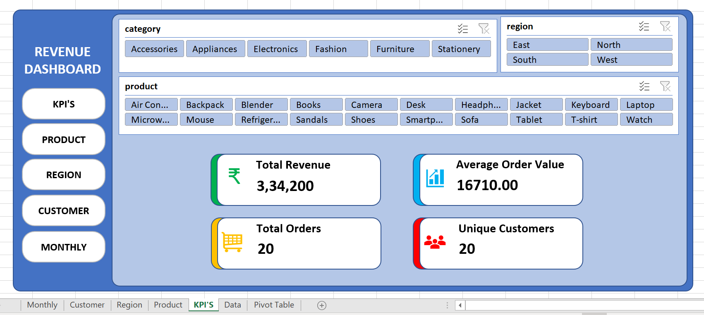
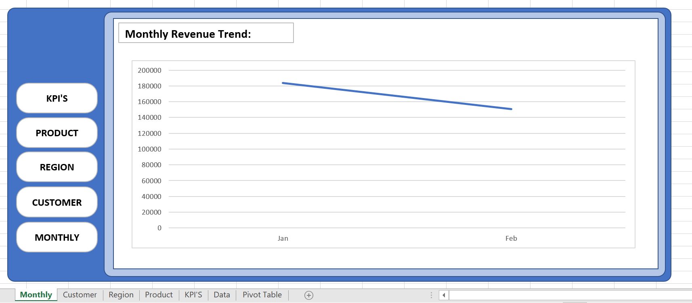
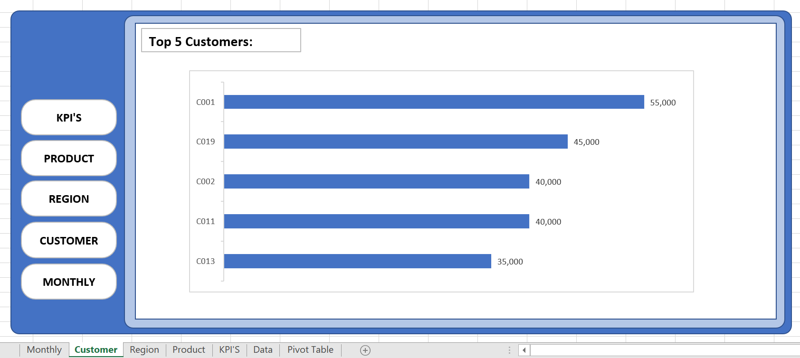
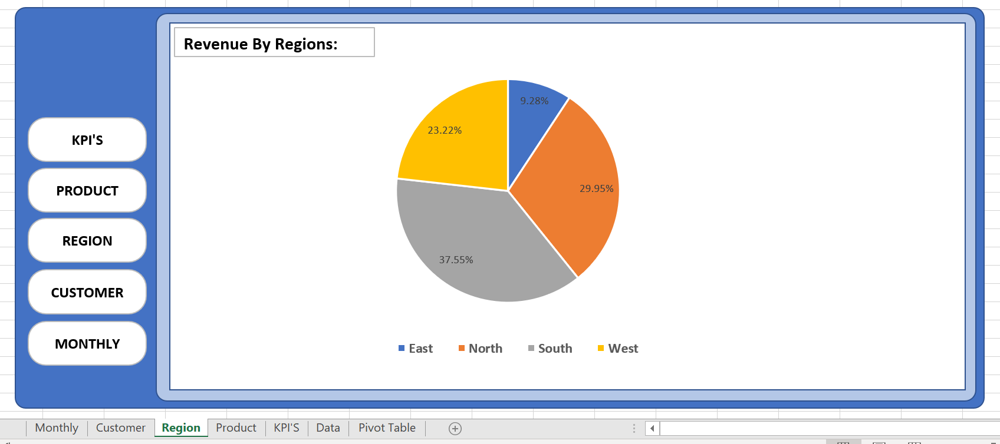
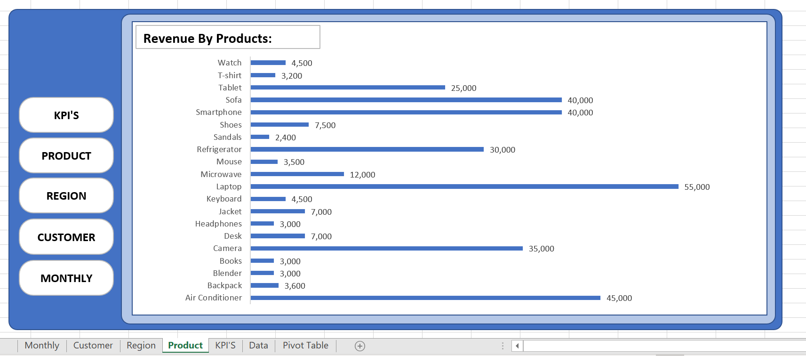

# E-Commerce Revenue Dashboard (Excel Project)

## Overview
This project presents an interactive E-commerce Revenue Dashboard built using Microsoft Excel. The dashboard analyzes sales performance across products, regions, customers, and time (monthly trends).

It is designed to help understand business performance, identify key revenue drivers, and support data-driven decision-making.

---

## Project Structure

```
ecommerce-revenue-dashboard/
│
├── images/
│   ├── kpi-dashboard.png
│   ├── monthly-trend.png
│   ├── customer-analysis.png
│   ├── region-analysis.png
│   └── product-analysis.png
│
├── excel/
│   └── ecommerce_dashboard.xlsx
│
└── README.md
```

---

## Dashboard Screens

### KPI Dashboard


Displays key business metrics:
- Total Revenue
- Average Order Value (AOV)
- Total Orders
- Unique Customers

---

### Monthly Revenue Trend


Shows month-wise revenue performance and helps identify growth or decline trends.

---

### Customer Analysis


Highlights the top 5 revenue-generating customers, useful for retention and loyalty strategies.

---

### Regional Analysis


Displays revenue contribution by region to support regional strategy decisions.

---

### Product Analysis


Shows revenue by product to identify top-performing and low-performing items.

---

## Key Insights

### High Average Order Value
- Total Revenue: 334,200
- Total Orders: 20
- Average Order Value: 16,710

This indicates that customers are purchasing multiple items per order. Possible reasons include effective upselling, cross-selling, or minimum order value requirements for free delivery. It may also indicate revenue concentration among a limited number of customers.

---

### Top Product Performance
- Laptop generates the highest revenue (55,000)

This suggests strong demand for laptops. Increasing marketing efforts for this product can further boost revenue. There is also an opportunity to bundle related products such as mouse, keyboard, and accessories to increase overall sales.

---

### Regional Contribution
- South region contributes the highest share (~37%)
- Followed by North and West

This indicates strong performance in these regions. Increasing marketing investment in high-performing regions and improving strategies in lower-performing regions can help optimize revenue.

---

### High-Value Customers
Top customers:
- C001
- C019
- C002
- C011
- C013

These customers contribute significantly to total revenue. Retention strategies such as exclusive offers, loyalty programs, and personalized engagement can help maintain and grow revenue.

---

### Monthly Trend
Revenue shows a decline from January to February. This may indicate seasonal variation, reduced demand, or lower marketing activity. Further analysis is required to identify the exact cause.

---

## Tools Used
- Microsoft Excel
- Pivot Tables
- Pivot Charts
- Slicers
- Dashboard Design using Shapes

---

## How to Use
1. Download the Excel file from the excel folder
2. Open it in Microsoft Excel
3. Use slicers to filter data by category, region, and product
4. Interact with the dashboard to explore insights

---

## Project Objective
The objective of this project is to demonstrate:
- Data analysis using Excel
- KPI calculation and interpretation
- Dashboard design and layout
- Business insight generation

---

## Future Improvements
- Add profit and margin analysis
- Include time-based forecasting
- Build an advanced version using Power BI
- Add customer segmentation analysis

---

## Author
Ayush  
Aspiring Data Analyst
